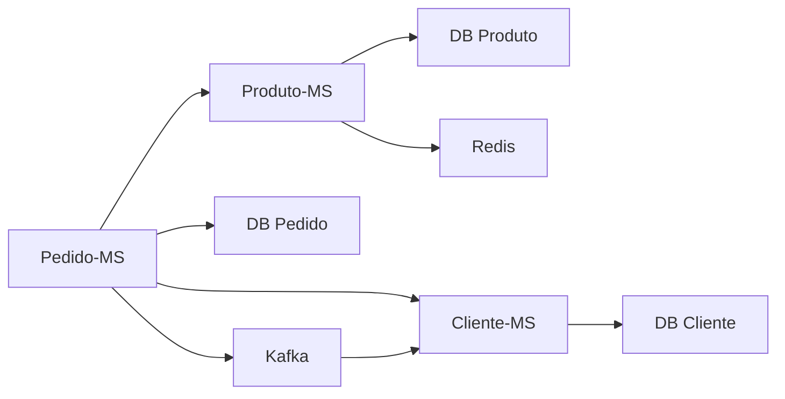

# Projeto de Portfólio: Microsserviços de E-commerce com Java e Spring


## 🎯 Sobre o Projeto

Este projeto demonstra a construção de um sistema de back-end para um e-commerce simplificado, utilizando uma **arquitetura de microsserviços**. O objetivo é apresentar uma solução robusta, moderna e escalável, aplicando padrões de design e tecnologias amplamente utilizadas no mercado.

O sistema é composto por três microsserviços principais: **`cliente-ms`**, **`produto-ms`**, e **`pedido-ms`**, que se comunicam de forma síncrona e assíncrona para orquestrar as operações.

---

## 🏛️ Arquitetura

O projeto segue o padrão **Database Per Service**, onde cada microsserviço possui seu próprio banco de dados (PostgreSQL), garantindo baixo acoplamento e autonomia.

-   **Comunicação Síncrona**: Utilizada para validações em tempo real. O `pedido-ms` consulta o `cliente-ms` e o `produto-ms` via **OpenFeign**.
-   **Comunicação Assíncrona**: Utilizada para notificar outros serviços sobre eventos de negócio. O `pedido-ms` publica um evento `pedido_criado` no **Apache Kafka**.

---
### Diagrama da Arquitetura


---
## Microsserviços
- **cliente-ms:** Responsável pelo CRUD de clientes. Também consome eventos do Kafka (ex: para enviar uma notificação de confirmação de pedido).
- **produto-ms:** Responsável pelo CRUD de produtos e controle de estoque. Utiliza Redis para cachear consultas de produtos e melhorar a performance.
- **pedido-ms:** Serviço orquestrador. Recebe as requisições de criação de pedido, valida a existência do cliente e dos produtos, e se tudo estiver correto, salva o pedido, debita o estoque e publica um evento no Kafka.
---

## 🚀 Como Executar o Projeto
### Pré-requisitos
- **Docker**
- **Docker Compose**
- O projeto é totalmente containerizado. Para subir toda a infraestrutura e os microsserviços, basta um único comando na raiz do projeto:
---

``` bash
   docker-compose up --build -d
```
---
## 🧪 Como Testar
Após a inicialização, as APIs estarão disponíveis e documentadas com Swagger.
- **Cliente MS**: http://localhost:8081/swagger-ui.html
- **Produto MS**: http://localhost:8082/swagger-ui.html
- **Pedido MS:** http://localhost:8083/swagger-ui.html
---
## Exemplos de Requisições (JSON)
1. Criar Cliente
```Json
{
"nome": "João da Silva",
"email": "joao.silva@example.com",
"senha": "senhaForte123"
}
```
2. Criar Produto
```Json
 {
  "nome": "Notebook Pro M3",
  "descricao": "Notebook com 16GB RAM, SSD 512GB e chip M3",
  "preco": 9850.50,
  "estoque": 25
}
```
3. Criar Pedido
   (Lembre-se de substituir pelos IDs reais que você obteve)
```Json
{
  "clienteId": "ID_DO_CLIENTE_GERADO_AQUI",
  "itens": [
    {
      "produtoId": "ID_DO_PRODUTO_GERADO_AQUI",
      "quantidade": 1
    }
  ]
}
```

### ⚠️Atenção: Para buscar clientes e produtos troque a palavra (string) no "sort" para (nome)

---
### ✒️ Autor - wrlandev

**LinkedIn:** https://linkedin.com/in/wrlansilva0
**GitHub:** https://github.com/wrlandev

